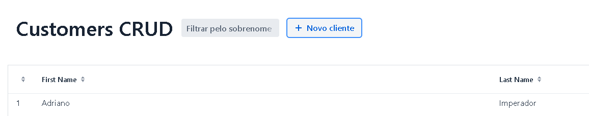
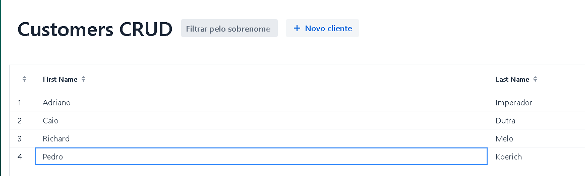

# Documentação para CRUD de clientes:
### Autores: Caio Dutra, Pedro Henrique K., Richard Melo

## Objetivo:

Criar uma aplicação que faria um gerenciamento de clientes para uma empresa não específica.

O CRUD foi a solução para esse problema, pois assim conseguimos usar grande parte dos conhecimentos apresentados em aula.

## Funcionamento do CRUD

### Primeira vez que for usar (caminho feliz):

## Cadastro:
- Criar um cadastro:
    
- Colocar o nome do cliente e salvar

    

- Será carregada a tela de visualização com o novo cadastro:
    

## Alterar:
- Achar o cliente desejado (nesse caso Pedro):
  
  Nesse caso o estagiário cadastrou o cliente Pedro com o sobrenome errado

- Para Alterar é só clicar no nome do Pedro na lista e salvar:
    

- Será carregada a tela de visualização com o cadastro alterado:
    